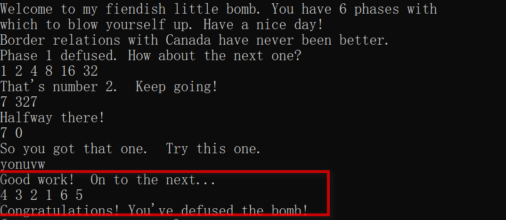
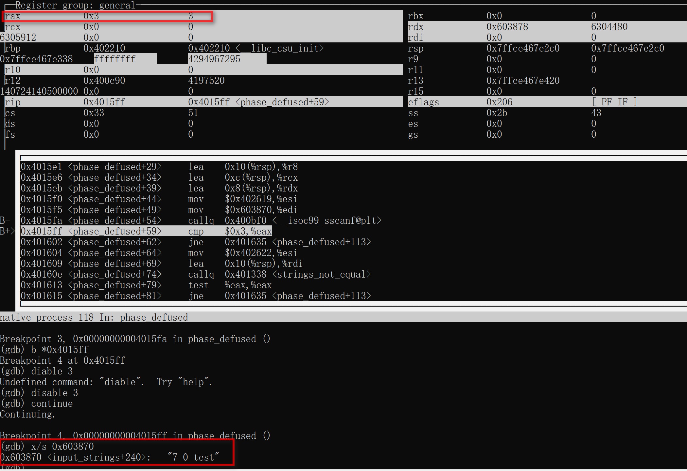
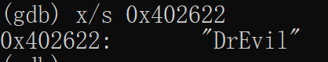
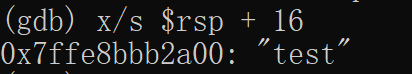
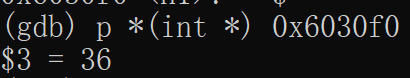
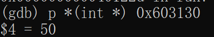
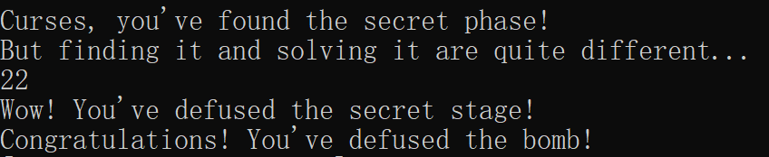
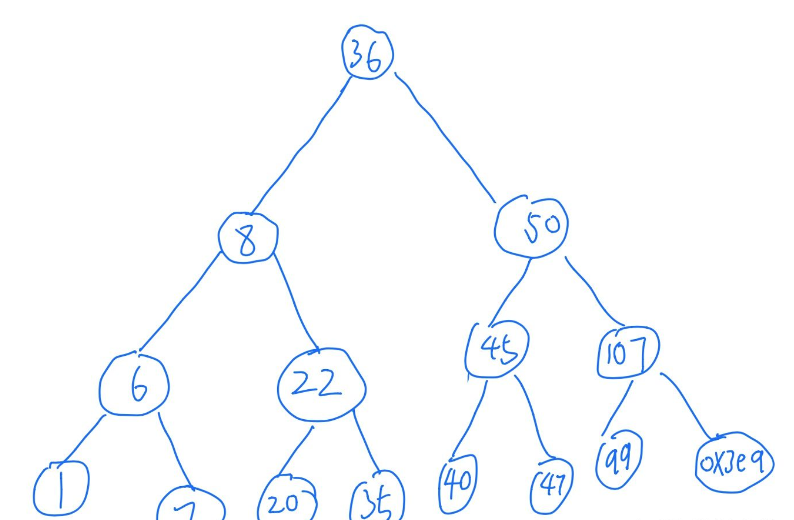

# 实验2：BombLab（下）

- [ 关卡6](#head1)
	- [<span id="head13"> 初始化部分</span>](#head2)
	- [<span id="head14"> 循环验值部分</span>](#head3)
	- [<span id="head15"> 转变参数值部分</span>](#head4)
	- [<span id="head16"> 修改地址值部分</span>](#head5)
	- [<span id="head17"> 验证有序部分</span>](#head6)
	- [<span id="head18"> 完整过程如下</span>](#head7)
- [ 彩蛋关卡](#head8)
	- [ 进入彩蛋前](#head9)
	- [ 破解彩蛋](#head10)
	- [ 破解fun7](#head11)
- [破解eax = 2](#head12)
	- [ 步骤1](#head13)
	- [ 步骤2](#head14)
	- [ 步骤3](#head15)
	- [ 补充内容：](#head16)
- [<span id="head19"><span id="head13"> 参考资料</span></span>](#head17)

后面这两关比较难，单独开个文档。

### <span id="head1"> 关卡6</span>

完整流程和伪代码可以翻到最后查看。

#### <span id="head2"><span id="head13"> 初始化部分</span></span>

```assembly
00000000004010f4 <phase_6>:
  #压栈
  4010f4:	41 56                	push   %r14
  4010f6:	41 55                	push   %r13
  4010f8:	41 54                	push   %r12
  4010fa:	55                   	push   %rbp
  4010fb:	53                   	push   %rbx
  #分配内存大小为80的栈帧
  4010fc:	48 83 ec 50          	sub    $0x50,%rsp
  401100:	49 89 e5             	mov    %rsp,%r13
  401103:	48 89 e6             	mov    %rsp,%rsi
  #关卡2分析过，读取6个参数
  401106:	e8 51 03 00 00       	callq  40145c <read_six_numbers>
  40110b:	49 89 e6             	mov    %rsp,%r14  #r14 赋值栈位置
  40110e:	41 bc 00 00 00 00    	mov    $0x0,%r12d #r12 赋值0
```

前面做了一些初始化操作。

```assembly
  401114:	4c 89 ed             	mov    %r13,%rbp  #rbp 赋值栈位置
  401117:	41 8b 45 00          	mov    0x0(%r13),%eax  #eax=参数1
  40111b:	83 e8 01             	sub    $0x1,%eax       #eax-1
  40111e:	83 f8 05             	cmp    $0x5,%eax       
  401121:	76 05                	jbe    401128 <phase_6+0x34>
  401123:	e8 12 03 00 00       	callq  40143a <explode_bomb>  #eax>5发生爆炸
```

这里的逻辑是取出第一个参数，对第一个参数减1，然后跟5比较，大于5发生爆炸。  也就是第一个参数要小于等于6，

```assembly
  401128:	41 83 c4 01          	add    $0x1,%r12d
  40112c:	41 83 fc 06          	cmp    $0x6,%r12d
  401130:	74 21                	je     401153 <phase_6+0x5f>
```

由于初始化赋值r12=0，所以必然不会进行跳转，接着往下看

#### <span id="head3"><span id="head14"> 循环验值部分</span></span>

```assembly
  401132:	44 89 e3             	mov    %r12d,%ebx
  401135:	48 63 c3             	movslq %ebx,%rax
  401138:	8b 04 84             	mov    (%rsp,%rax,4),%eax
  40113b:	39 45 00             	cmp    %eax,0x0(%rbp)
  40113e:	75 05                	jne    401145 <phase_6+0x51>
  401140:	e8 f5 02 00 00       	callq  40143a <explode_bomb>
  401145:	83 c3 01             	add    $0x1,%ebx
  401148:	83 fb 05             	cmp    $0x5,%ebx
  40114b:	7e e8                	jle    401135 <phase_6+0x41>
  40114d:	49 83 c5 04          	add    $0x4,%r13  #参数1
  401151:	eb c1                	jmp    401114 <phase_6+0x20> #间接跳转
```

从前面逻辑`mov    %rsp,%r13`,`mov    %r13,%rbp`

看出 `0x0(%rbp)`存储的是第1个参数位置

而`(%rsp,%rax,4)`中，rax=r12=1，存储的是第2个参数位置。

这一段需要保证参数1、2不相等。 即参数1!=参数2

`cmp    $0x5,%ebx`这段由于ebx当前值为1，所以要进行5次循环，

所以要保证后面的每个参数都不等于参数1

将参数1地址+4后，变成参数2又间接跳转到0x401114位置

**进行回退**：

```assembly
  401114:	4c 89 ed             	mov    %r13,%rbp  #rbp 赋值栈位置
  401117:	41 8b 45 00          	mov    0x0(%r13),%eax  #eax=参数2
  40111b:	83 e8 01             	sub    $0x1,%eax       #eax-1
  40111e:	83 f8 05             	cmp    $0x5,%eax       
  401121:	76 05                	jbe    401128 <phase_6+0x34>
  401123:	e8 12 03 00 00       	callq  40143a <explode_bomb>  #eax>5发生爆炸
  401128:	41 83 c4 01          	add    $0x1,%r12d
  40112c:	41 83 fc 06          	cmp    $0x6,%r12d
  401130:	74 21                	je     401153 <phase_6+0x5f>
  401132:	44 89 e3             	mov    %r12d,%ebx
  401135:	48 63 c3             	movslq %ebx,%rax
  401138:	8b 04 84             	mov    (%rsp,%rax,4),%eax
  40113b:	39 45 00             	cmp    %eax,0x0(%rbp)
  40113e:	75 05                	jne    401145 <phase_6+0x51>
  401140:	e8 f5 02 00 00       	callq  40143a <explode_bomb>
  401145:	83 c3 01             	add    $0x1,%ebx
  401148:	83 fb 05             	cmp    $0x5,%ebx
  40114b:	7e e8                	jle    401135 <phase_6+0x41>
  40114d:	49 83 c5 04          	add    $0x4,%r13  #参数1
  401151:	eb c1                	jmp    401114 <phase_6+0x20> #间接跳转
```

由于上面将r13+4，所以指向栈的下一个位置，即从参数2开始分析，

1. eax(参数2)-1<=5,  r12=2，并且参数2！=参数3
2. 这里也经过循环，需要保证参数2！=参数3~6
3. **综上，需要保证所有参数小于6、大于0，并且所有参数不相等。**

我们尝试`6 5 4 3 2 1`作为答案，继续往下分析：

#### <span id="head4"><span id="head15"> 转变参数值部分</span></span>

```assembly
  401153:	48 8d 74 24 18       	lea    0x18(%rsp),%rsi #rsi=栈的第7个位置
  401158:	4c 89 f0             	mov    %r14,%rax       #rax为栈首位置
  40115b:	b9 07 00 00 00       	mov    $0x7,%ecx       
  401160:	89 ca                	mov    %ecx,%edx	   #edx=7
  401162:	2b 10                	sub    (%rax),%edx     
  401164:	89 10                	mov    %edx,(%rax)     #7-参数1，存回rax地址
  401166:	48 83 c0 04          	add    $0x4,%rax	   #进入下一个参数位置
  40116a:	48 39 f0             	cmp    %rsi,%rax
  40116d:	75 f1                	jne    401160 <phase_6+0x6c>
```

这里用`7-参数1`存回到参数1中,然后把参数7跟参数2进行比较，不相等回退到0x401160位置。（**由于参数7没有设置，实际上就是进行了6次循环**。）

假设发生了回退，继续分析

```assembly
  401160:	89 ca                	mov    %ecx,%edx	   #edx=7
  401162:	2b 10                	sub    (%rax),%edx     
  401164:	89 10                	mov    %edx,(%rax)     #7-参数2，存回rax地址
  401166:	48 83 c0 04          	add    $0x4,%rax	   #进入下一个参数位置
  40116a:	48 39 f0             	cmp    %rsi,%rax
  40116d:	75 f1                	jne    401160 <phase_6+0x6c>
```

按照这个逻辑，每次都将7-参数x，然后将下一个参数跟参数7比较，相等则停止循环。

当这段逻辑运行到参数7跟参数7自己比较时，结束循环。

**此时假如我们输入`6 5 4 3 2 1 ` 会转变成`1 2 3 4 5 6`**

#### <span id="head5"><span id="head16"> 修改地址值部分</span></span>

```assembly
  40116f:	be 00 00 00 00       	mov    $0x0,%esi        #esi=0
  401174:	eb 21                	jmp    401197 <phase_6+0xa3> #间接跳转
```

这里对esi进行初始化，然后发生跳转，接着往下分析

```assembly
  401197:	8b 0c 34             	mov    (%rsp,%rsi,1),%ecx #ecx=栈首位置
  40119a:	83 f9 01             	cmp    $0x1,%ecx
  40119d:	7e e4                	jle    401183 <phase_6	+0x8f>
```

参数1小于等于1，跳转到0x401183

```assembly
  401183:	ba d0 32 60 00       	mov    $0x6032d0,%edx    #edx=$0x6032d0
  401188:	48 89 54 74 20       	mov    %rdx,0x20(%rsp,%rsi,2) 
  40118d:	48 83 c6 04          	add    $0x4,%rsi
  401191:	48 83 fe 18          	cmp    $0x18,%rsi
  401195:	74 14                	je     4011ab <phase_6+0xb7>
  401197:	8b 0c 34             	mov    (%rsp,%rsi,1),%ecx #进入下个参数
  40119a:	83 f9 01             	cmp    $0x1,%ecx
  40119d:	7e e4                	jle    401183 <phase_6+0x8f>
```

把$0x6032d0存到栈第8个位置。

**这里我们可以看到给了一个立即数，里面很有可能有重要的信息（从后面要验证的信息可以推断里面是整数）。所以用`p *(int *) 0x6032d0`打印里面的内容查看**

```shell
(gdb) p *(int *) 0x6032d0
$7 = 332
(gdb) p *(int *) 0x6032e0
$8 = 168
(gdb) p *(int *) 0x6032f0
$9 = 924
(gdb) p *(int *) 0x603300
$10 = 691
(gdb) p *(int *) 0x603310
$11 = 477
(gdb) p *(int *) 0x603320
$12 = 443
```

比较rsi是否等于0x18。

不相等，继续往下，进入到参数2，参数2=2，大于1，继续往下。

```assembly
  40119f:	b8 01 00 00 00       	mov    $0x1,%eax
  4011a4:	ba d0 32 60 00       	mov    $0x6032d0,%edx
  4011a9:	eb cb                	jmp    401176 <phase_6+0x82>
```

初始化eax=1，edx=0x6032d0，跳转到0x401176

```assembly
  401176:	48 8b 52 08          	mov    0x8(%rdx),%rdx #rdx+8
  40117a:	83 c0 01             	add    $0x1,%eax  #eax=2
  40117d:	39 c8                	cmp    %ecx,%eax
  40117f:	75 f5                	jne    401176 <phase_6+0x82>
  401181:	eb 05                	jmp    401188 <phase_6+0x94>
```

rdx+8后打印内容为250

比较eax跟参数2，不相等，回退0x401176，发生循环，否则跳转到0x401188，

重复次数跟参数大小有关，(**也就是这里实际上是利用参数的值，将0x6032d0第x个位置的值存入栈中，x为当前循环的参数值**)

```assembly
  401188:	48 89 54 74 20       	mov    %rdx,0x20(%rsp,%rsi,2)
  40118d:	48 83 c6 04          	add    $0x4,%rsi
  401191:	48 83 fe 18          	cmp    $0x18,%rsi
  401195:	74 14                	je     4011ab <phase_6+0xb7>
  401197:	8b 0c 34             	mov    (%rsp,%rsi,1),%ecx 
  40119a:	83 f9 01             	cmp    $0x1,%ecx
  40119d:	7e e4                	jle    401183 <phase_6+0x8f>
```

rsp栈存入了rdx的内容，位置从20开始

这里又回到之前的循环位置，总长度24，每次增加4，所以一共循环6次

此时ecx=参数3，重复前面内容。

```assembly
  40119f:	b8 01 00 00 00       	mov    $0x1,%eax
  4011a4:	ba d0 32 60 00       	mov    $0x6032d0,%edx
  4011a9:	eb cb                	jmp    401176 <phase_6+0x82>
  401176:	48 8b 52 08          	mov    0x8(%rdx),%rdx #rdx+8
  40117a:	83 c0 01             	add    $0x1,%eax  #eax=2
  40117d:	39 c8                	cmp    %ecx,%eax
  40117f:	75 f5                	jne    401176 <phase_6+0x82>
  401181:	eb 05                	jmp    401188 <phase_6+0x94>
```

此时%ecx=3,%eax=2，回跳到0x401176，eax+1。

ecx=eax符合条件，又回退到401188进行下一轮验证

**综合上面的内容，上面的操作，就是通过参数的值，将0x6032d0这个地址，从d0开始数，向0x20(%rsp,%rsi,2) 这段距离开始，值取出并填充,而填充值通过参数从0x6032d0进行索引计算，来决定值**

```assembly
  401188:	48 89 54 74 20       	mov    %rdx,0x20(%rsp,%rsi,2)
  40118d:	48 83 c6 04          	add    $0x4,%rsi
  401191:	48 83 fe 18          	cmp    $0x18,%rsi
  401195:	74 14                	je     4011ab <phase_6+0xb7>
```

当6轮都填充完后，进入0x4011ab位置

```assembly
  4011ab:	48 8b 5c 24 20       	mov    0x20(%rsp),%rbx
  4011b0:	48 8d 44 24 28       	lea    0x28(%rsp),%rax
  4011b5:	48 8d 74 24 50       	lea    0x50(%rsp),%rsi
  4011ba:	48 89 d9             	mov    %rbx,%rcx
  4011bd:	48 8b 10             	mov    (%rax),%rdx
  4011c0:	48 89 51 08          	mov    %rdx,0x8(%rcx)
  4011c4:	48 83 c0 08          	add    $0x8,%rax
  4011c8:	48 39 f0             	cmp    %rsi,%rax
  4011cb:	74 05                	je     4011d2 <phase_6+0xde>
  4011cd:	48 89 d1             	mov    %rdx,%rcx
  4011d0:	eb eb                	jmp    4011bd <phase_6+0xc9>
```

这里在做的事情，**是将存在rsp栈中的内容，插回到rcx寄存器，也就是0x6032d0开始数的位置。修改寄存器的值**

实际上是一个**单链表**，对单链表的值顺序进行调换。

```assembly
0x6032d0 <node1>: 0x0000014c  0x00000001  0x006032e0  0x00000000
0x6032e0 <node2>: 0x000000a8  0x00000002  0x006032f0  0x00000000
0x6032f0 <node3>: 0x0000039c  0x00000003  0x00603300  0x00000000
0x603300 <node4>: 0x000002b3  0x00000004  0x00603310  0x00000000
0x603310 <node5>: 0x000001dd  0x00000005  0x00603320  0x00000000
0x603320 <node6>: 0x000001bb  0x00000006  0x00000000  0x00000000

node3>node4>node5>node6>node1>node2
```

#### <span id="head6"><span id="head17"> 验证有序部分</span></span>

```assembly
  4011d2:	48 c7 42 08 00 00 00 	movq   $0x0,0x8(%rdx) #rdx+8=0
  4011d9:	00 
  4011da:	bd 05 00 00 00       	mov    $0x5,%ebp	#ebp=5
  4011df:	48 8b 43 08          	mov    0x8(%rbx),%rax   #rax=rbx+8
  4011e3:	8b 00                	mov    (%rax),%eax
  4011e5:	39 03                	cmp    %eax,(%rbx)
  4011e7:	7d 05                	jge    4011ee <phase_6+0xfa>
  4011e9:	e8 4c 02 00 00       	callq  40143a <explode_bomb>
  4011ee:	48 8b 5b 08          	mov    0x8(%rbx),%rbx
  4011f2:	83 ed 01             	sub    $0x1,%ebp
  4011f5:	75 e8                	jne    4011df <phase_6+0xeb>
  4011f7:	48 83 c4 50          	add    $0x50,%rsp
  4011fb:	5b                   	pop    %rbx
  4011fc:	5d                   	pop    %rbp
  4011fd:	41 5c                	pop    %r12
  4011ff:	41 5d                	pop    %r13
  401201:	41 5e                	pop    %r14
  401203:	c3                   	retq   
```

rdx=0x50(%rsp)=0

这里的突破口是`cmp    %eax,(%rbx)` 如果rbx <= eax 则发生爆炸。

rbx是栈的首地址。

rax = rbx + 0x8。也就是下个数的地址。 

**可以推断出这里的逻辑是每轮都保证rbx>eax，即下一个数小于上一个数，即可拆解炸弹。**

关键点在于，起始位置应该是最大值，依次存放较小值。 

我们回顾一下0x6032d0一开始存放的内容，如下所示。

```shell
(gdb) p *(int *) 0x6032d0
$7 = 332
(gdb) p *(int *) 0x6032e0
$8 = 168
(gdb) p *(int *) 0x6032f0
$9 = 924
(gdb) p *(int *) 0x603300
$10 = 691
(gdb) p *(int *) 0x603310
$11 = 477
(gdb) p *(int *) 0x603320
$12 = 443
```

也就是要让下面的内容**按照924、691、477、433、332、168的顺序排序。即数字3、4、5、6、1、2。**

由于中间发生过`7-参数`的操作，所以实际上应该输入的数字串为**4、3、2、1、6、5**。炸弹成功解除。



#### <span id="head7"><span id="head18"> 完整过程如下</span></span>

1. 先读取前6个参数
2. 验证每个参数的值大于0，小于等于6，并且每个参数互不相等。
3. 进行`参数=7-参数`的操作。
4. 将`0x6032d0`寄存器内的数值通过参数进行调换。
5. 验证`0x6032d0`寄存器内的值是否为从大到小。

整个流程的伪代码如下

```assembly
cin>>a[6];//输入六个数
if(a[i]=a[i+1]||a[i]>6)bomb! i=1~6所有元素都不能相同都不能大于6
//这里我们有一个单链表
 node1->node2->node3->node4->node5->node6
 /由于最后我们的链表要满足单调递减
 / 按照值进行排序如下。所以我们重新排序的链表顺序必须如下
 node3>node4>node5>node6>node1>node2
 List *L=new(List(-1));/新建一个链表 
for(int i=1;i<=6;i++){
  if(a[i]==6)L[i]=node1; /L[i]表示我们新链表的第i个结点。
  else{
    int b=7-a[i],p=node1;
    while(b--){
      p=p->next;
    }
    L[i]=p; /这里就是7-a[i]为多少就把node[7-a[i]]赋给L[i]
  }
}
```


> 第5关第6关花了一个下午+一个晚上终于完成了。第6关没有发现打印整数p *(int *)的指令，一直用x/s去查看地址的值，所以一直没看懂逻辑，中间从地址取出，存到栈，又放回寄存器的过程也读了好久才理解。但炸弹解出来后其实整个流程也挺简单，在汇编代码上却很难读懂，不过能独立做出来真的太不容易了。

---

### <span id="head8"> 彩蛋关卡</span>

#### <span id="head9"> 进入彩蛋前</span>

首先通过分析`phase_defused`炸弹拆除函数,源码里面有一段`callq  401242 <secret_phase>`，

```assembly
00000000004015c4 <phase_defused>:
  4015c4:	48 83 ec 78          	sub    $0x78,%rsp
  4015c8:	64 48 8b 04 25 28 00 	mov    %fs:0x28,%rax
  4015cf:	00 00 
  4015d1:	48 89 44 24 68       	mov    %rax,0x68(%rsp) 
  4015d6:	31 c0                	xor    %eax,%eax      #eax=0
  4015d8:	83 3d 81 21 20 00 06 	cmpl   $0x6,0x202181(%rip)        # 603760 <num_input_strings>
  
---

  40164f:	e8 dc f4 ff ff       	callq  400b30 <__stack_chk_fail@plt>
  401654:	48 83 c4 78          	add    $0x78,%rsp
  401658:	c3                   	retq   
  401659:	90                   	nop
  40165a:	90                   	nop
  40165b:	90                   	nop
  40165c:	90                   	nop
  40165d:	90                   	nop
  40165e:	90                   	nop
  40165f:	90                   	nop

```

触发彩蛋的条件，需要输入到第6条字符串，否则会跳过彩蛋。

往下分析

```assembly
  4015e1:	4c 8d 44 24 10       	lea    0x10(%rsp),%r8  #r8=rsp+16
  4015e6:	48 8d 4c 24 0c       	lea    0xc(%rsp),%rcx  #rcx = rsp+12
  4015eb:	48 8d 54 24 08       	lea    0x8(%rsp),%rdx  #rdx = rsp+8
  4015f0:	be 19 26 40 00       	mov    $0x402619,%esi
  4015f5:	bf 70 38 60 00       	mov    $0x603870,%edi
  4015fa:	e8 f1 f5 ff ff       	callq  400bf0 <__isoc99_sscanf@plt>
  4015ff:	83 f8 03             	cmp    $0x3,%eax
  401602:	75 31                	jne    401635 <phase_defused+0x71>
```

看到立即数，先打印里面的内容看看，提供思路

```assembly
(gdb) x/s 0x402619
0x402619:       "%d %d %s"   #两个整数  一个字符
(gdb) x/s 0x603870
0x603870 <input_strings+240>:   "7 0"    #似曾相识的数字
```

从这段内容可以做一些猜想，

1. 用于验证的部分是需要输入  整数、整数、字符串
2. 其中整数部分的值是“7 0”，也就是我们关卡4中输入的值。

```assembly
  4015fa:	e8 f1 f5 ff ff       	callq  400bf0 <__isoc99_sscanf@plt>
  4015ff:	83 f8 03             	cmp    $0x3,%eax
```

这部分是验证输入的参数数量是否为3。

我们在关卡4输入"7 0 test"尝试



由上图可以看到正如我们猜想的一模一样。继续往下分析

```assembly
  401604:	be 22 26 40 00       	mov    $0x402622,%esi
  401609:	48 8d 7c 24 10       	lea    0x10(%rsp),%rdi
  40160e:	e8 25 fd ff ff       	callq  401338 <strings_not_equal>
  401613:	85 c0                	test   %eax,%eax
  401615:	75 1e                	jne    401635 <phase_defused+0x71>
```

同样，打印立即数。



得到DrEvil，而rsp+16是我们关卡4输入的字符串，调用了`strings_not_equal`



所以关卡4的答案改为"7 0 DrEvil"

```assembly
  401617:	bf f8 24 40 00       	mov    $0x4024f8,%edi
  40161c:	e8 ef f4 ff ff       	callq  400b10 <puts@plt>
  401621:	bf 20 25 40 00       	mov    $0x402520,%edi
  401626:	e8 e5 f4 ff ff       	callq  400b10 <puts@plt>
  40162b:	b8 00 00 00 00       	mov    $0x0,%eax
  401630:	e8 0d fc ff ff       	callq  401242 <secret_phase>
  401635:	bf 58 25 40 00       	mov    $0x402558,%edi
  40163a:	e8 d1 f4 ff ff       	callq  400b10 <puts@plt>
```

接下来打印了两段话

```
Curses, you've found the secret phase!
But finding it and solving it are quite different...
```

自此，终于进入了secret_phase彩蛋环节。

#### <span id="head10"> 破解彩蛋</span>

```assembly
0000000000401242 <secret_phase>:
  401242:	53                   	push   %rbx  #压栈
  401243:	e8 56 02 00 00       	callq  40149e <read_line> #读取输入
  401248:	ba 0a 00 00 00       	mov    $0xa,%edx   #edx=10
  40124d:	be 00 00 00 00       	mov    $0x0,%esi   #esi=0
  401252:	48 89 c7             	mov    %rax,%rdi   #rdi=输入
  401255:	e8 76 f9 ff ff       	callq  400bd0 <strtol@plt>
  40125a:	48 89 c3             	mov    %rax,%rbx   #rbx=rax
  40125d:	8d 40 ff             	lea    -0x1(%rax),%eax  #eax = 0xffffffff
  401260:	3d e8 03 00 00       	cmp    $0x3e8,%eax #参数小于等于1000
  401265:	76 05                	jbe    40126c <secret_phase+0x2a> <=0x3e8
  401267:	e8 ce 01 00 00       	callq  40143a <explode_bomb>
  40126c:	89 de                	mov    %ebx,%esi   #esi=参数
  40126e:	bf f0 30 60 00       	mov    $0x6030f0,%edi #edi=36
  401273:	e8 8c ff ff ff       	callq  401204 <fun7>
 
```

调用了`strtol@plt`，暂时还不知道用处，先继续往下看。

`cmp    $0x3e8,%eax`  需要让rax - 1后小于等于0x3e8（1000），(其中eax为输入值)否则爆炸。

立即数0x6030f0打印结果为36



#### <span id="head11"> 破解fun7</span>

```assembly
0000000000401204 <fun7>:
  401204:	48 83 ec 08          	sub    $0x8,%rsp
  401208:	48 85 ff             	test   %rdi,%rdi
  40120b:	74 2b                	je     401238 <fun7+0x34> #rdi是否为0
  40120d:	8b 17                	mov    (%rdi),%edx #edx=(rdi)=36
  40120f:	39 f2                	cmp    %esi,%edx
  401211:	7e 0d                	jle    401220 <fun7+0x1c> #输入值是否大于36
  401213:	48 8b 7f 08          	mov    0x8(%rdi),%rdi
  401217:	e8 e8 ff ff ff       	callq  401204 <fun7>
  40121c:	01 c0                	add    %eax,%eax
  40121e:	eb 1d                	jmp    40123d <fun7+0x39>
```

`cmp    %esi,%edx`、`jle    401220 <fun7+0x1c>`检查参数是否大于36，大的话跳转到0x401220

由于测试的值是200，所以发生跳转

```assembly
  401220:	b8 00 00 00 00       	mov    $0x0,%eax
  401225:	39 f2                	cmp    %esi,%edx
  401227:	74 14                	je     40123d <fun7+0x39> #检查参数值是否等于36
```

不等于36往下继续

```assembly
  401229:	48 8b 7f 10          	mov    0x10(%rdi),%rdi
  40122d:	e8 d2 ff ff ff       	callq  401204 <fun7>
  401232:	8d 44 00 01          	lea    0x1(%rax,%rax,1),%eax
  401236:	eb 05                	jmp    40123d <fun7+0x39>
  401238:	b8 ff ff ff ff       	mov    $0xffffffff,%eax
  40123d:	48 83 c4 08          	add    $0x8,%rsp
  401241:	c3                   	retq   
```

rdi=50，又进入调用fun7



```shell
#循环func7
(gdb) p *(int *) 0x6030f0
$7 = 36
(gdb) p *(int *) 0x603130
$6 = 50
(gdb) p *(int *) 0x6031b0
$5 = 107
1001
```

员工有4个区间值[0,36]、(36,50]、(50,107]、(107, 1001]

试一下临界值 36

```assembly
  401278:	83 f8 02             	cmp    $0x2,%eax
  40127b:	74 05                	je     401282 <secret_phase+0x40>
  40127d:	e8 b8 01 00 00       	callq  40143a <explode_bomb>
```

返回的eax=0，发生爆炸。

### <span id="head12">破解eax = 2</span>

根据上面的尝试可以进行推理。

刚开始eax=参数-1，找到能计算出eax=2的路径是。

1. eax=0
2. eax = eax +1
3. eax = eax + eax

由于是函数是递归的，所以正确的顺序应该倒过来

1. eax = eax + eax   调用fun7 返回
2. eax = 0、调用fun7、eax = eax + 1 返回
3. 返回

#### <span id="head13"> 步骤1</span>

```assembly
  40120d:	8b 17                	mov    (%rdi),%edx #edx=(rdi)=36
  40120f:	39 f2                	cmp    %esi,%edx
  401211:	7e 0d                	jle    401220 <fun7+0x1c> #输入值是否大于36
  401213:	48 8b 7f 08          	mov    0x8(%rdi),%rdi
  401217:	e8 e8 ff ff ff       	callq  401204 <fun7>
  40121c:	01 c0                	add    %eax,%eax
  40121e:	eb 1d                	jmp    40123d <fun7+0x39>
```

要触发`add    %eax,%eax`，参数值需要小于36。又一次调用`func7`

#### <span id="head14"> 步骤2</span>

```assembly
  40120d:	8b 17                	mov    (%rdi),%edx #edx=(rdi)=36
  40120f:	39 f2                	cmp    %esi,%edx
  401211:	7e 0d                	jle    401220 <fun7+0x1c> #输入值是否大于8
  
  ---
  401220:	b8 00 00 00 00       	mov    $0x0,%eax
  401225:	39 f2                	cmp    %esi,%edx
  401227:	74 14                	je     40123d <fun7+0x39>
  401229:	48 8b 7f 10          	mov    0x10(%rdi),%rdi
  40122d:	e8 d2 ff ff ff       	callq  401204 <fun7>
  401232:	8d 44 00 01          	lea    0x1(%rax,%rax,1),%eax
  401236:	eb 05                	jmp    40123d <fun7+0x39>
```

此时edx = 8，eax初始化为0，才能进入`lea    0x1(%rax,%rax,1),%eax`，参数需要大于8并且不能等于8，使eax = eax +1。在这之前又调用了`fun7`

#### <span id="head15"> 步骤3</span>

```assembly
  401204:	48 83 ec 08          	sub    $0x8,%rsp
  401208:	48 85 ff             	test   %rdi,%rdi
  40120b:	74 2b                	je     401238 <fun7+0x34>
  40120d:	8b 17                	mov    (%rdi),%edx
  40120f:	39 f2                	cmp    %esi,%edx
  401211:	7e 0d                	jle    401220 <fun7+0x1c>
 
---
  401220:	b8 00 00 00 00       	mov    $0x0,%eax
  401225:	39 f2                	cmp    %esi,%edx
  401227:	74 14                	je     40123d <fun7+0x39>
  40123d:	48 83 c4 08          	add    $0x8,%rsp
  401241:	c3                   	retq   
```

根据之前的推理，步骤3不需要对eax进行操作，只需要返回上一层就行了，这一轮edx=22，所以要让esi=edx=22。

最后回退上一层，本来eax = 0， 进行`lea    0x1(%rax,%rax,1),%eax`和`add    %eax,%eax`最后跳转到0x40123d退出fun7函数。

```assembly
  401278:	83 f8 02             	cmp    $0x2,%eax
  40127b:	74 05                	je     401282 <secret_phase+0x40>
  40127d:	e8 b8 01 00 00       	callq  40143a <explode_bomb>
```

验证eax = 2，破解成功



#### <span id="head16"> 补充内容：</span>

fun7函数里实际上这个过程是一个二叉树，随着数字的大小而选择指定位置。

```cpp
(gdb) x/120 0x6030f0
0x6030f0 <n1>:	0x00000024	0x00000000	0x00603110	0x00000000
0x603100 <n1+16>:	0x00603130	0x00000000	0x00000000	0x00000000
0x603110 <n21>:	0x00000008	0x00000000	0x00603190	0x00000000
0x603120 <n21+16>:	0x00603150	0x00000000	0x00000000	0x00000000
0x603130 <n22>:	0x00000032	0x00000000	0x00603170	0x00000000
0x603140 <n22+16>:	0x006031b0	0x00000000	0x00000000	0x00000000
0x603150 <n32>:	0x00000016	0x00000000	0x00603270	0x00000000
0x603160 <n32+16>:	0x00603230	0x00000000	0x00000000	0x00000000
0x603170 <n33>:	0x0000002d	0x00000000	0x006031d0	0x00000000
0x603180 <n33+16>:	0x00603290	0x00000000	0x00000000	0x00000000
0x603190 <n31>:	0x00000006	0x00000000	0x006031f0	0x00000000
0x6031a0 <n31+16>:	0x00603250	0x00000000	0x00000000	0x00000000
0x6031b0 <n34>:	0x0000006b	0x00000000	0x00603210	0x00000000
0x6031c0 <n34+16>:	0x006032b0	0x00000000	0x00000000	0x00000000
0x6031d0 <n45>:	0x00000028	0x00000000	0x00000000	0x00000000
0x6031e0 <n45+16>:	0x00000000	0x00000000	0x00000000	0x00000000
0x6031f0 <n41>:	0x00000001	0x00000000	0x00000000	0x00000000
0x603200 <n41+16>:	0x00000000	0x00000000	0x00000000	0x00000000
0x603210 <n47>:	0x00000063	0x00000000	0x00000000	0x00000000
0x603220 <n47+16>:	0x00000000	0x00000000	0x00000000	0x00000000
0x603230 <n44>:	0x00000023	0x00000000	0x00000000	0x00000000
0x603240 <n44+16>:	0x00000000	0x00000000	0x00000000	0x00000000
0x603250 <n42>:	0x00000007	0x00000000	0x00000000	0x00000000
0x603260 <n42+16>:	0x00000000	0x00000000	0x00000000	0x00000000
0x603270 <n43>:	0x00000014	0x00000000	0x00000000	0x00000000
0x603280 <n43+16>:	0x00000000	0x00000000	0x00000000	0x00000000
0x603290 <n46>:	0x0000002f	0x00000000	0x00000000	0x00000000
0x6032a0 <n46+16>:	0x00000000	0x00000000	0x00000000	0x00000000
0x6032b0 <n48>:	0x000003e9	0x00000000	0x00000000	0x00000000
0x6032c0 <n48+16>:	0x00000000	0x00000000	0x00000000	0x00000000
```

根据上图可以画出这棵树



> 到这里bombLab就全部破解完毕了，这里的题目也都是先自己独立做出来后，再参考资料，看有哪些被忽略的地方，所以题解实际上包含了思考的过程，导致整个笔记可能会有点乱。对阅读可能不太友好，之后看看有没有时间再回来整理看看。
>
> 现在开始进入下一个lab的学习。

### <span id="head17"><span id="head19"><span id="head13"> 参考资料</span></span></span>

[超精讲-逐例分析 CSAPP：Lab2-Bomb!(上)](https://zhuanlan.zhihu.com/p/339461318)

[超精讲-逐例分析 CSAPP：Lab2-Bomb!(下)](https://zhuanlan.zhihu.com/p/339575162)
