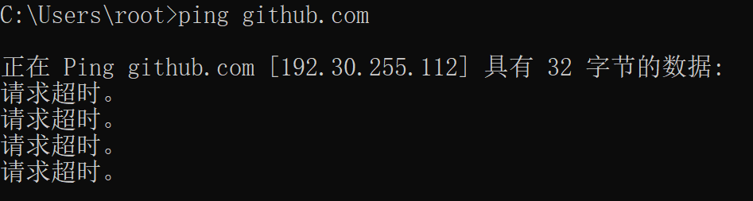
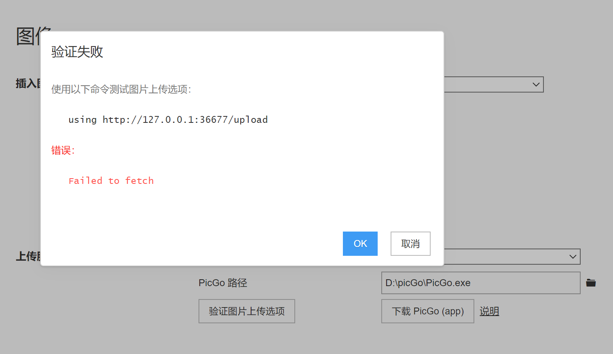
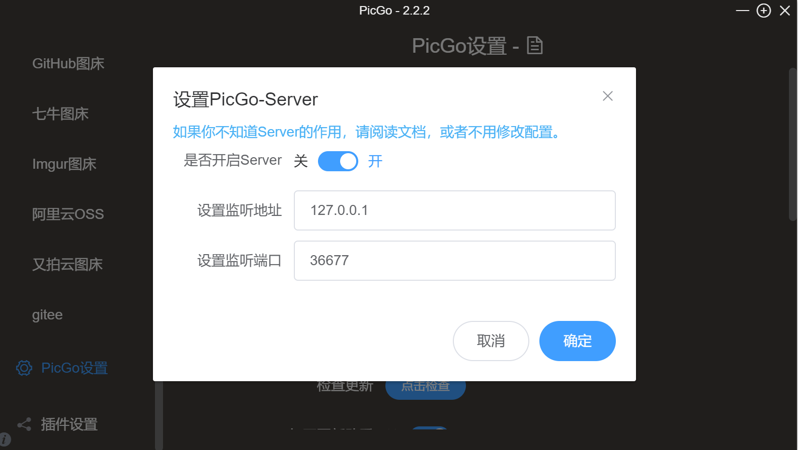
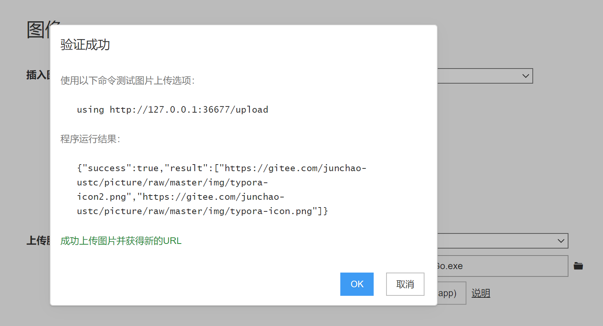
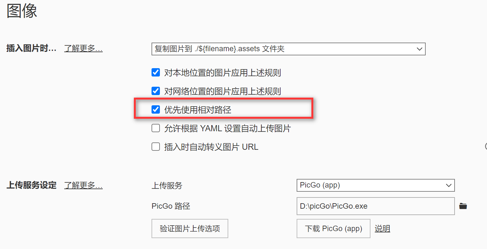

# 实验外日志

- [<span id="head1">1.git push上传失败</span>](#head1)
- [<span id="head2"> 2.配置typora图床</span>](#head2)
- [<span id="head3">3.typora图片"image load failed"</span>](#head3)
- [<span id="head4"> 4.github不支持markdown自动生成目录</span>](#head4)
### <span id="head1"><span id="head1">1.git push上传失败</span></span>

```
$ git push origin main
ssh: connect to host github.com port 22: Connection timed out
fatal: Could not read from remote repository.

Please make sure you have the correct access rights
and the repository exists.
```

`ping github.com`  ：发生超时



尝试了[GitHub提交代码提示连接失败](https://delpast.com/post/POSTTB_9ce693cebc864789ba0748aeeb227b76)里面提及的，在hosts中添加github相关地址，但并没有生效，

同时[gdb手册](chrome-extension://chphlpgkkbolifaimnlloiipkdnihall/onetab.html)打不开。

无法进行科学上网。

最后猜测可能校园网出问题了，切换成自己的热点就可以git push了，从而解决问题。。。。

### <span id="head2"><span id="head2"> 2.配置typora图床</span></span>



可能端口不一致导致，



修改picgo端口为36677，则成功上传



### <span id="head3"><span id="head3">3.typora图片"image load failed"</span></span>

[解决方案](https://www.cnblogs.com/JiangLiHong/p/14861166.html)

但是上传到github上有些图片也显示不出来，

改用相对路径



可能也是因为校园网的问题，切换热点就没那么多问题。

### <span id="head4"><span id="head4"> 4.github不支持markdown自动生成目录</span></span>

采用工具，将.md文件内容拷贝进行convert，得到带描点的目录结构

[Markdown TOC generator](https://toc.codepie.fun/)

### 5.docker desktop : Hardware assisted virtualization and data execution protection must be enabled

1. 确保hyper-v组件已经开启
2. 确保其守护进程自动运行

解決方案如下链接所示

https://blog.csdn.net/u012588542/article/details/85378508

